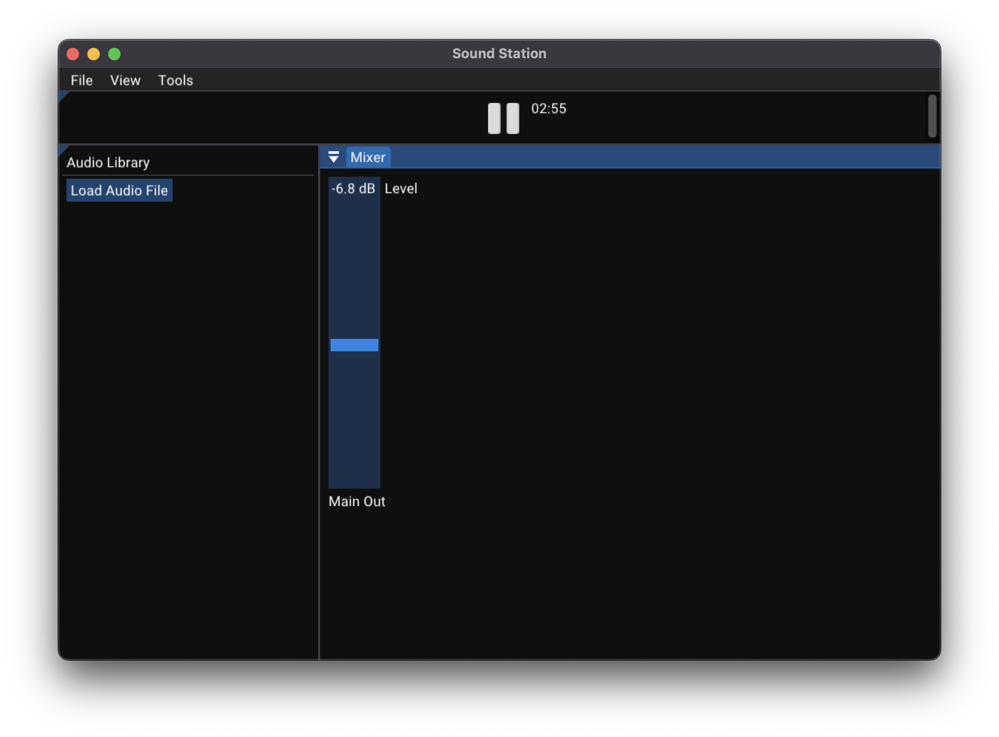

# soundstation

A simple DAW made by Johan Solbakken.

## Dependencies
For macos
~~~
cd dependencies
cd macos
brew bundle
~~~

## Build and run

~~~bash
git clone --recursive https://github.com/johansolbakken/soundstation
cd soundstation
mkdir build
cd build
cmake ..
make
cd soundstation
./soundstation
~~~

# Plan

1. Audio Recording: Users should be able to record audio from microphones and other sources. This includes support for multiple audio tracks.

1. MIDI Support: Incorporate MIDI sequencing capabilities, allowing users to create and edit MIDI data for virtual instruments and external MIDI devices.

1. Audio Editing: Implement basic audio editing features like cut, copy, paste, trim, fade in/out, and time-stretching to manipulate audio clips.

1. Virtual Instruments: Include some basic virtual instruments like synthesizers, samplers, and drum machines. These instruments should be MIDI controllable.

1. Audio Effects: Include a set of basic audio effects like EQ, reverb, delay, compression, and distortion that users can apply to audio tracks.

1. Mixing and Routing: Enable users to mix and route audio and MIDI tracks, including the ability to adjust volume, pan, and send tracks to buses.

1. Automation: Implement automation capabilities for controlling parameters of virtual instruments and effects over time.

1. Arrangement View: Provide a timeline or arrangement view where users can arrange and sequence audio and MIDI clips to create complete songs.

1. Time Signature and Tempo Control: Allow users to set different time signatures and tempos within their projects.

1. Basic File Management: Enable users to save and load projects, import audio files, and export their creations in common audio file formats.

1. User Interface: Design an intuitive and user-friendly interface with features like drag-and-drop functionality, resizable windows, and customizable layouts.

1. Keyboard Shortcuts: Implement keyboard shortcuts to streamline workflow and improve efficiency.

1. Plugin Support: Support for third-party VST/AU plugins, which expand the DAW's capabilities with additional instruments and effects.

1. Basic Mixing and Mastering Tools: Include tools for adjusting levels, panning, and basic mastering processing to ensure the final mix sounds polished.

1. Performance Optimization: Optimize your DAW for efficient CPU and RAM usage to ensure it runs smoothly even on less powerful systems.

1. Basic MIDI and Audio Export Options: Allow users to export their projects as MIDI files or audio files in various formats.

1. Undo/Redo: Implement an undo/redo feature to let users easily correct mistakes.

1. Help and Documentation: Provide user documentation and possibly tutorial resources to help users understand and utilize the software effectively.

1. Project Backup: Automatic project backup and recovery options to prevent data loss.

1. Cross-Platform Compatibility: Consider developing your DAW to run on multiple operating systems (e.g., Windows, macOS, and Linux) for a wider user base.

(Generated by ChatGPT)